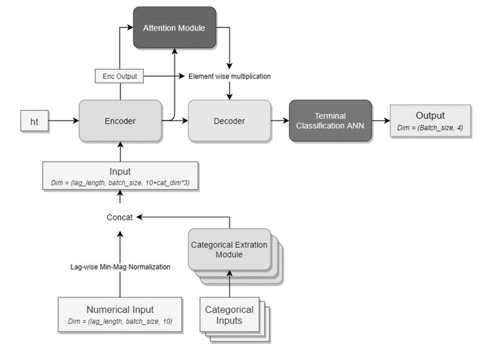

# MLOps MIPT course

## Тема
   Предсказание поведения цены на горизонтальных ценовых уровнях для алготрейдинга

## Формулировка задачи
   Одним из подходов в трейдинге является торговля от горизонтальных уровней. Уровень - область на ценовой шкале, где ожидается более интенсивное сопротивление текущему движению цены. Одной из задач является собственно идентификация этих уровней, другой - предсказание того, как цена себя поведет при взаимодействии с уровнем в пределах некоторого прогнозного окна - 1) пробъет , 2) отскочит, 3) будет осциллировать возле уровня. 
   Проект посвящен решению второй задачи. Это необходимо для поиска оптимальных точек входа и выхода из позиции в алготрейдинге.

## Данные
   Данные торгов загружаются из Yahoo Finance с помощью python-библиотеки yfinance и сохраняются локально в csv (в дальнейшем в БД). А именно, стандартная 5-ка - open, high, low, close, volume для таймфреймов M1, H1, D1, W1. Значения всех индикаторов вычисляются на основании этих сырых данных и, если необходимо, сохраняются для повторного использования.  В текущей постановке задачи для прогнозирования поведения цены инструмента на уровнях используются только элементы технического анализа и общие соображения о поведении игроков на рынке. Для этого достаточно сырых данных торгов по выбранному инструменту и, возможно, по инструментам, с которыми он скоррелирован (например, индексы, сырьевые товары, базовый актив для ПФИ и пр.). В будущем возможно использование дополнительных источников данных, например новостных лент.
   
   Возможная проблема - ограничения на глубину и объем одновременно загружаемых данных.

## Подход к моделированию
   Основной рабочий фреймворк  - PyTorch , поскольку он очень популярен в DL (большое комьюнити) и имеет развитые возможности.

   Приблизительная архитектура нейросети: 
   
   
Модель состоит из следующих основных модулей: 
   1. Модули извлечения категориальных признаков 
   1. Энкодер
   1. Декодер
   1. Attention-модуль
   1. Слой терминальной классификации
          
Сеть решает задачу классификации на 3 класса  - 3 исхода взаимодействия цены с уровнем (см. выше).

## Способ предсказания 
С помощью отдельного внешнего сервиса модель каждые N дней (по умолчанию N=2) дообучается и тестируется на свежих данных, поступивших с момента последнего обучения. Новая версия модели кладется рядом с текущей с новым именем (например, загружается в папку на сервер по ssh). Предусмотрен режим запуска обучения с нуля и валидации модели на заданных временных интервалах (запускается вручную).

Торговый бот написан на python, т.к. это не high frequency trading, предсказание модели происходит не чаще, чем 1-2 раза в минуту, производительности хватает. При обнаружении новой версии модели бот загружает ее и отражает это в логе. Бот с некоторой периодичностью обновляет метрики качества своей работы по сделкам, закрытым и открытым. С помощью отдельного инструмента анализа метрик с web-UI оператор мониторит корректность работы системы с учетом регулярных обновлений модели. Также есть сервис автоматического мониторинга торговых ботов, в котором настроены алерты на резкое изменение контролируемых метрик.

